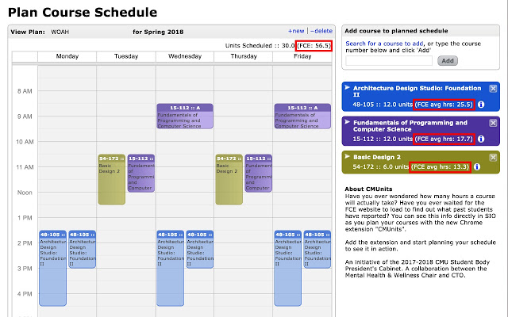

CMUnits
----

The CMUnits extension inserts average hours spent data from Faculty Course Evaluations (FCEs)
into the schedule planning process for Carnegie Mellon University students.
This information is collected from students like you at the end of each semester when
you fill out FCEs and report how much time you spent on a course during an average week.
This data is best used as a guide rather than an exact estimate.

How It Works
----

- Data is shown from the last semester the course was taught.
- The current version does not take instructor into account, so if a course is taught by multiple instructors, an average is taken across lecturers.
- No data is presented for a course if it is a new course, no data exists, or there were less than five responses the last time it was taught.

Screenshots
---

Privacy: we do not store any data
----

Feel free to check the [source code](https://github.com/cmu-student-government/cmunit/tree/master/src)

We appreciate your
    [feedback](https://docs.google.com/forms/d/e/1FAIpQLSfIXZzPUekxeUMeR0l27fnTCPI_d5FEBOXGpMR4h2riG_FpqQ/viewform)!

For Firefox users: The XPI file to install the extension can be found [here](https://cmu-student-government.github.io/cmunit/cmunit.xpi)!
